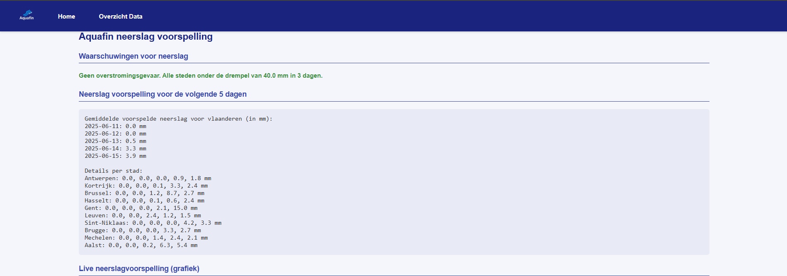

# Aquafin Overstromingsrisico Webapp

Deze webapplicatie toont het actuele en historische overstromingsrisico in Vlaanderen op basis van maandelijkse neerslagdata en live voorspellingen.

## Functionaliteiten

- **Live overstromingswaarschuwing:**  
  Als er in één Vlaamse stad in de komende 3 dagen 40mm of meer neerslag voorspeld wordt, verschijnt bovenaan een waarschuwing.
- **Actuele voorspelling:**  
  5-daagse neerslagvoorspelling voor 10 Vlaamse steden, opgehaald via de Open-Meteo API.  
  Toont het Vlaams gemiddelde, per stad én als interactieve grafiek.
- **Historische data:**  
  Tabel met alle maandelijkse neerslag van 2005 t/m 2025.  
  Voor 2025 worden ontbrekende maanden als `X` weergegeven.
- **Zoekfunctionaliteit:**  
  Zoek kleindere gemeentes of steden die voorspelling weergeven
  en gevaar bij toepassing.
- **Branding:**  
  Professionele header en footer in Aquafin-stijl met logo en officiële contactgegevens.

## Gebruikte technologieën

- Java 17
- Spring Boot
- Thymeleaf (view templates)
- Chart.js (grafieken)
- Open-Meteo API (live data)
- HTML/CSS (custom, responsive)
- Maven
- Nominatim API
## Team

- Abdullah
- Noah
- Kimberley
- Dalil
- Raihane

## Bestandenstructuur

- `src/main/java/be/ehb/be.ehb.aquafin/Controller/IndexController.java`: Hoofdcontroller, dataverwerking, API-calls
- `src/main/java/be/ehb/be.ehb.aquafin/Controller/vorigeDataController.java`: Neerslag geschiedenis
- `src/main/java/be/ehb/be.ehb.aquafin/Service/NeerslagService.java`: Service voor het ophalen & verwerken van weerdata
- `src/main/resources/templates/index.html`
- `src/main/resources/templates/vorigeData.html`
## Screenshots**

## Bronnen
- Alle ehb cursussen van dit jaar
- https://open-meteo.com/
- https://www.aquafin.be/nl-be
- https://nominatim.openstreetmap.org/
- https://chat.openai.com/  

- chats van Noah: 
- https://chatgpt.com/share/68496888-f6d4-8009-8007-cfce7f206923,
- https://chatgpt.com/share/684968ae-fb18-8009-837d-3dd25ce73d39, 
- https://chatgpt.com/share/68496875-4650-8009-b0a8-5b9afb37e815,
- https://chatgpt.com/share/684aa50b-7210-8009-9697-4f9ee68b5592

chats van abdullah:
https://chatgpt.com/share/68496753-6b6c-800c-96e6-a9ef0fbf2f4e

Chat van Kimberley: https://chatgpt.com/share/684963ee-8498-8005-9ce1-a5c4bf6a5470
